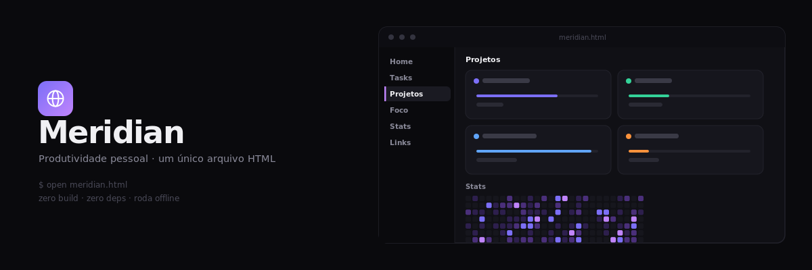
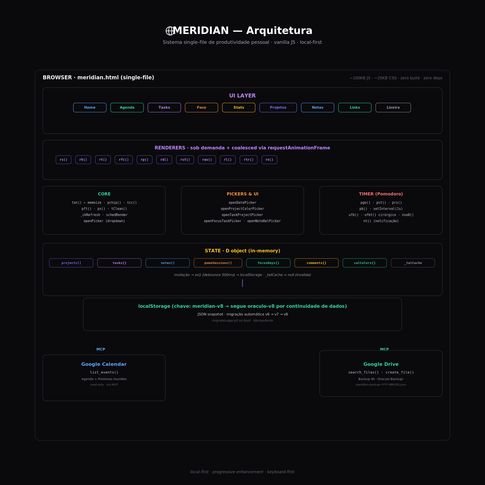
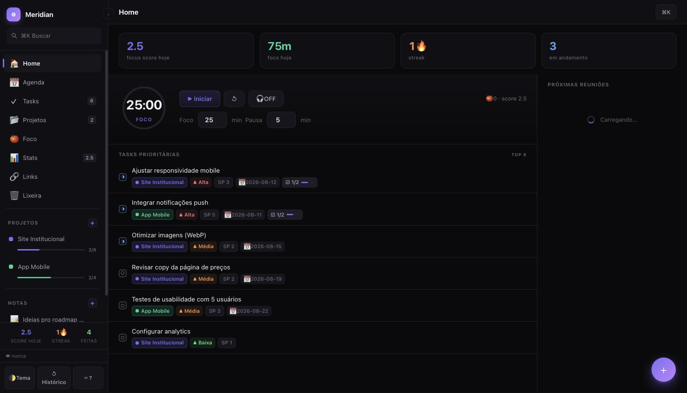
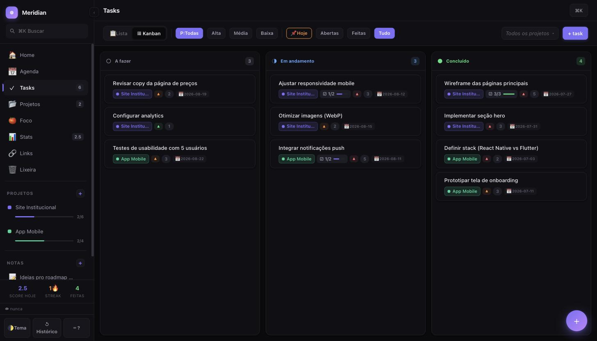
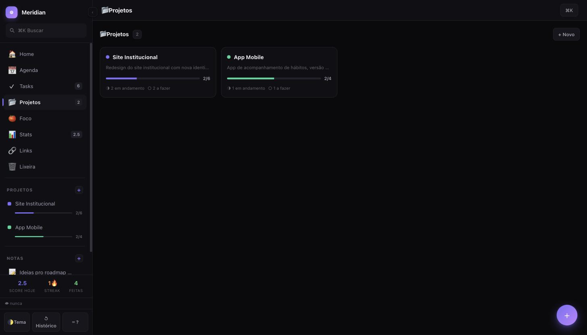
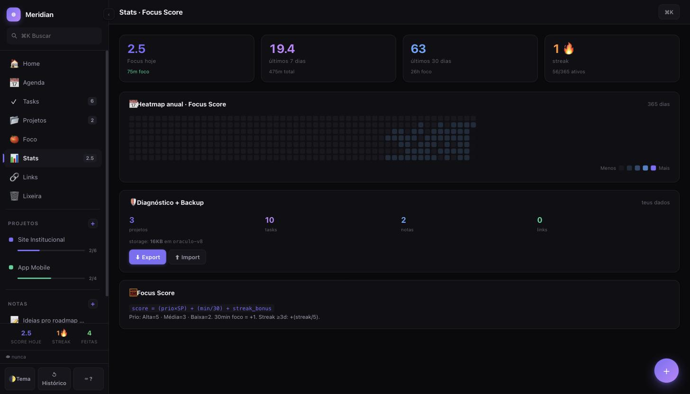
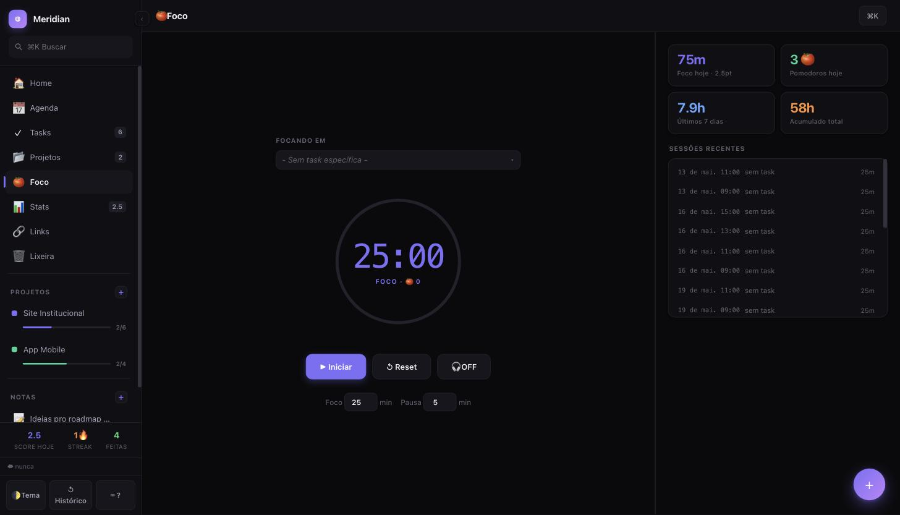

🌐 **Demo ao vivo**: [lavinialencar.github.io/meridian](https://lavinialencar.github.io/meridian/) — *dados de exemplo, só pra mostrar a interface (não sincroniza com nenhum uso real)*

Sistema unificado de produtividade pessoal em um único arquivo HTML. Roda 100% local no browser, com backup automático opcional no Google Drive.

Escrito em vanilla JS + CSS, sem build step, sem dependências.

*(nasceu como "Oráculo" — renomeado pra Meridian; identificadores internos como o schema de storage seguem `oraculo-*` por continuidade de dados, ver nota técnica mais abaixo)*

---

## ✨ Features

### Views
- **🏠 Home** — dashboard com Focus Score, streak, KPIs, top 8 tasks prioritárias, timer Pomodoro embutido, próximas reuniões
- **📅 Agenda** — visão semanal do Google Calendar + tasks com prazo
- **✓ Tasks** — lista ou kanban, filtros por prioridade/status/projeto, drag-and-drop entre colunas
- **📂 Projetos** — página própria (não só a lista lateral): grid com todos os projetos, progresso, contagem por status. Clique abre o kanban do projeto
- **🍅 Foco** — Pomodoro timer com checklist interativa da task selecionada + stats de foco (hoje, 7d, acumulado, sessões recentes)
- **📊 Stats** — heatmap anual (estilo GitHub), 4 gráficos, Focus Score composto
- **🔗 Links** — catálogo agrupado por domínio (Databricks, Google Drive, YouTube, Notion, Figma, Linear, Confluence, Jira, Slack, Mural, Miro, Meet, GitHub) auto-detectados de tasks e notas
- **🗑 Lixeira** — soft-delete de tasks, notas e projetos

### Interações
- **⌘K** omnibar com busca fuzzy em tasks, projetos, notas e comandos
- **Keyboard shortcuts**: `g h` (home), `g a` (agenda), `g t` (tasks), `g p` (projetos), `g f` (foco), `g s` (stats), `g l` (links), `/` (busca), `n` (nova task/nota/projeto via FAB), `⌘Z`/`Ctrl+Z` (desfazer última mudança), `?` (ajuda), `Esc` (reset overlays / fecha drawer)
- **Drag-to-reorder projetos** no sidebar
- **Color picker** por projeto (12 cores)
- **Themes**: dark (default) / light — toggle no rodapé do sidebar

### Tasks
- Status (todo / doing / done), prioridade (alta / média / baixa), story points (1/2/3/5/8), prazo (custom date picker)
- Checklist com barra de progresso (visível no drawer E na página Foco)
- Comentários locais
- Foco acumulado por task
- Drawer lateral com edição inline (título auto-focus em nova task)

### Backup automático
- Salva `oraculo-backup-YYYY-MM-DD.json` na pasta `Oraculo Backup` do teu Google Drive a cada 4h (nome da pasta mantido de propósito — ver nota técnica)
- Botão manual `☁` no rodapé do sidebar
- Skip se arquivo do dia já existe (não polui o Drive)

### Histórico de versões (undo além do soft-delete)
- A cada save, o estado anterior vira um snapshot em `localStorage['meridian-history']` — até 20, com no mínimo ~20s entre um e outro (evita spam em edições rápidas)
- **⌘Z / Ctrl+Z** restaura o snapshot mais recente (com confirmação — o estado atual também vira snapshot antes de restaurar, então dá pra "desfazer o desfazer")
- Painel completo em **↺ Histórico** no rodapé do sidebar, ou `⌘K` → "Histórico de versões" — lista todos os snapshots com data/hora, restaura qualquer um
- É local (não depende do backup no Drive). Complementa, não substitui: histórico cobre "últimos minutos/horas", Drive cobre "dias/semanas"

### Performance (cirúrgica)
- `tat()` memoizado (cache invalidado ao salvar)
- Timer da Focus view atualiza via `setAttribute` (sem rebuild do DOM a cada segundo)
- Renders coalescidos em `requestAnimationFrame` (drag-drop não dispara múltiplos re-renders)
- Early returns em rederers quando view não está visível
- Try/catch nos ticks de timer pra não congelar

---

## 🏗 Stack

- **Frontend**: vanilla JS + CSS custom properties (design tokens)
- **Storage**: localStorage (schema `oraculo-v8` com migração automática de versões antigas)
- **Backup**: Google Drive via MCP (Model Context Protocol) do Cowork
- **Integrações opcionais**: Google Calendar (eventos), Google Drive (backup + arquivos)

Sem framework. Sem build. Sem npm. Sem tooling.

**Tamanho**: ~100KB de JS, ~20KB de CSS, tudo num único arquivo HTML.



---

## 📸 Screenshots

| Home | Tasks (Kanban) |
|---|---|
|  |  |

| Projetos | Stats |
|---|---|
|  |  |



---

## 🚀 Rodando

### Opção 1: Cowork (contexto original)
1. Abre no Cowork/Claude Desktop com este arquivo como artifact
2. Conecta Google Calendar e Google Drive via MCP
3. Backup roda automaticamente a cada 4h

### Opção 2: Standalone (sem MCP)
1. Abre o arquivo `meridian.html` direto no browser (double-click)
2. Tudo funciona **exceto**:
   - Google Calendar (agenda + próximas reuniões ficam vazios)
   - Backup automático no Drive (dados só ficam no localStorage do browser)
3. Você continua tendo: tasks, projetos, foco, stats, notas, checklist, temas, atalhos

**Standalone**: pra backup manual, use o botão "Export JSON" (função `exd()` no console) que baixa um snapshot dos dados.

### Opção 3: Deploy estático
- GitHub Pages: coloca `meridian.html` como `index.html` e ativa Pages
- Vercel/Netlify: drop-in
- Localhost: `python3 -m http.server 8080` na pasta

Como é um arquivo single-file, sem CORS, sem CSP restrito, roda em qualquer lugar.

---

## 📁 Estrutura de dados

Tudo persiste em `localStorage['oraculo-v8']`:

```json
{
  "projects": [
    {
      "id": "uuid",
      "title": "Projeto Exemplo",
      "shortName": "PE",
      "color": "#c084fc",
      "description": "...",
      "date": "2026-06-11",
      "tasks": [
        {
          "id": "uuid",
          "title": "Tarefa exemplo",
          "status": "doing",
          "priority": "alta",
          "storyPoints": 3,
          "due": "2026-06-15",
          "notes": "...",
          "checklist": [{"id":"uuid","text":"Item","done":false}]
        }
      ]
    }
  ],
  "notes": [{"id":"uuid","title":"...","body":"...","checklist":[],"relatedType":"project|task","relatedId":"..."}],
  "pomoSessions": [{"completedAt":"ISO","durationMin":25,"taskId":"..."}],
  "focusDays": {"2026-06-11":{"focusMin":75,"tasksCompleted":[...]}},
  "comments": {"local:taskId":{"local":[...]}},
  "calColors": {"cal-id":"#hex"}
}
```

### Migrações
- `oraculo-v6` → `oraculo-v7` → `oraculo-v8` (função `mg()` no código)
- Campo `oraculo-jira-cleaned=1` marca migração one-shot de dados legados Jira
- Campo `meridian-fresh-start=1` marca reset one-shot que limpa qualquer dado de seed/teste que já tenha sido persistido antes desse flag existir — roda uma vez só, depois nunca mais mexe nos dados

### Nota técnica: por que `oraculo-*` continua no código
A chave do localStorage (`oraculo-v8`) e a pasta de backup no Drive (`Oraculo Backup`) foram mantidas como estão de propósito. Renomear esses identificadores internos criaria uma base de dados nova e vazia — você perderia acesso às tasks/projetos já salvos. O nome "Meridian" mudou em tudo que é visível (título, logo, sidebar, docs); o que é invisível e já tem dado gravado, ficou igual.

---

## 🎨 Design tokens

Todos os estilos usam CSS custom properties (`--bg`, `--tx`, `--ac`, etc.) definidos em `[data-theme=dark]` e `[data-theme=light]`. Trocar tema = trocar variáveis, sem re-renderização.

Palette dark:
- `--ac` roxo `#7c6ff7` (accent primary)
- `--a2` `#c084fc` (accent secondary)
- `--tl` verde `#34d399` (teal)
- `--or` `#fb923c` (streak fire)
- `--bl` `#60a5fa` (info)
- `--rd` `#f87171` (delete/error)

---

## 🧠 Filosofia

**Local-first**: teus dados nunca saem do teu browser (a menos que você ative o backup no Drive). Nada de servidor, nada de conta, nada de tracking.

**Zero build**: um arquivo HTML. Você pode editar direto e ver o resultado no browser em 1 segundo. Não precisa saber webpack, nem React, nem TypeScript.

**Progressive enhancement**: as features MCP (Calendar, Drive) são opcionais. Se não estiverem conectadas, o Meridian continua funcionando como um caderninho pessoal robusto.

**Keyboard-first**: praticamente tudo tem atalho. Sem mouse dependencies.

---

## 🧭 Por que existe

Começou como um teste rápido ("Oráculo") pra resolver um problema bem concreto: gerenciar tasks, projetos e foco num só lugar, sem depender de conta, servidor ou assinatura de mais um SaaS. Virou o Meridian — mesma filosofia, agora com nome e identidade próprios.

Não é um produto pensado pra escalar; é uma ferramenta pessoal que eu mantenho porque uso todo dia. Deixei pública porque pode ser útil pra quem quer algo parecido: local-first, sem fricção, sem infra pra manter.

---

## 📄 Licença

MIT. Uso pessoal.

Feito com ☕ e 🍅 por Lavínia Alencar.
